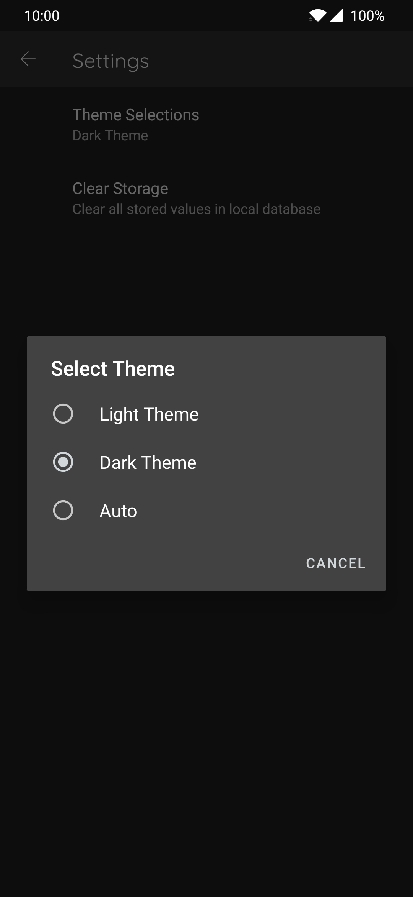

# Imgur Search Sample
Android Application sample based on Mvvm, Koin, LiveData, Paging, Room, AndroidX Preference &amp; Coroutines

## It contains
1. **Home Page**
  * Search bar to search images via Imgur Api
  * List of the images retrieved by local db
2. **Inner page**
  * Full width view of selected image
  * Input view for local comments
  * List of comments retried from local db
3. **Settings**
  * Theme selector
  * Cache Cleaner

  
  
  
  

Dark theme | Light Theme | Inner page | Preference
--- | --- | --- | ---

## How it Works
When text is typed in search view data is fetched from database. If data is not available in local database network call is made and inserted into local database and reflected back in UI. When image list is scrolled and all the values from database is reflected in UI another Network call is made to fetch the next page data and insert it into the database, and this process goes on. Each search is stored in key value pairs to get data which is searched before instantly.

## Features
1. ***MVVM*** architecture pattern
2. Offline support
3. Day Night Theme supported
4. Option to retry when network call fails
5. Latest AndroidX preference for settings
6. Design compatible to both phone and tablet
7. Infinite scroll via Paging
8. 250ms debounce on search
9. Pull to refersh 

## Libraries Used

 `Android Architecture Components`
* LiveData
* ViewModel
* Paging
* Preference
 `Dependency Injection`
* Koin
 `asynchronous programming`
* Kotlin Coroutines
`Image Loading`
* Glide
 

